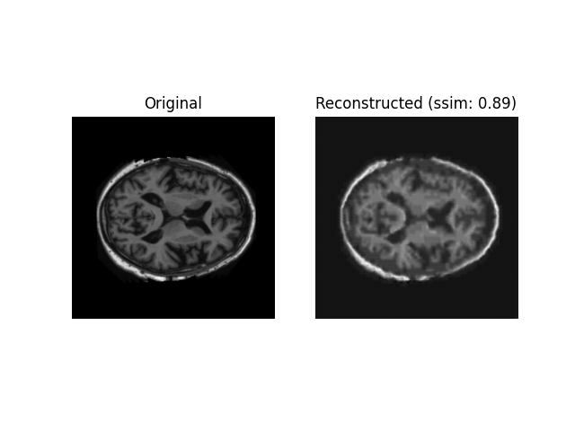
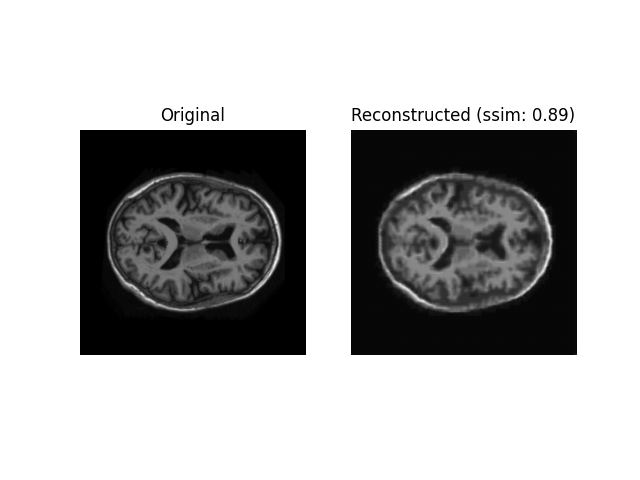
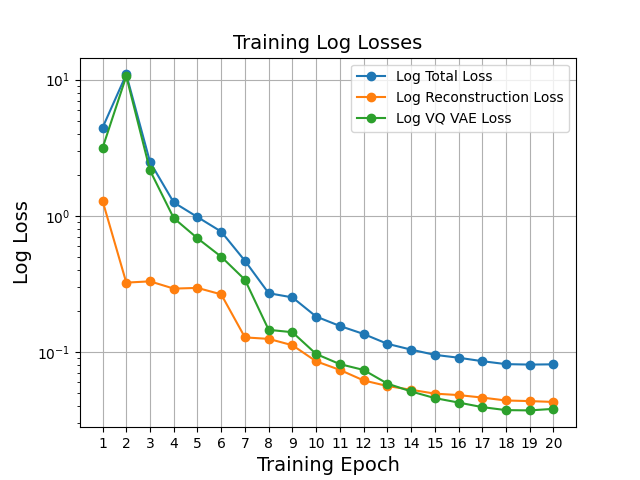

# Synthetic Brain MRI Image Generation with VQ-VAE (COMP3710)

by Alex Nicholson, 45316207

---

## Project Overview

### The Algorithm and the Problem

**Description of the algorithm and the problem that it solves (approximately a paragraph):**
The algorithm implemented in this project is a [VQ-VAE](https://arxiv.org/abs/1711.00937) (Vector Quantised - Variational Auto-Encoder) model, which is an architecture that aims to encode data into a compressed format (embedding higher dimensional data into a lower dimenisional subspace) and then decode this compressed format to recreate the original image as closely as possible. What are we using it to do here...???

...Dataset: [OASIS](https://www.oasis-brains.org/#data)...

### How it Works

**How it works (approximately a paragraph):**
It works by transforming the image into a set of encoding vectors, using a CNN (convolutional neural network) encoder network, which are then quantised to fit the codebook vectors of the model. These quantised encodings are then passed to the decoder network which is made up of a transposed convolution (deconvolution) layers, which generated a synthetic reconstruction that is very similar to the original input image. ...???

### Goals

The performance goals for this project are, generally, for the model to produce a “reasonably clear image” and also, more concretely, for the model to achieve an average structured similarity index (SSIM) of over 0.6.

---

## Usage Guide

### Installation

1. Install Anaconda
2. Create a clean conda environment and activate it
3. Install all of the required packages (see dependancy list below)
4. Download the OASIS dataset from [this link](https://cloudstor.aarnet.edu.au/plus/s/tByzSZzvvVh0hZA/download)

### Usage

* Run `python train.py` to train the model
* Run `python predict.py` to test out the trained model

### Dependancies

The following dependancies were used in the project:

* tensorflow (version 2.9.2)
* tensorflow_probability (version 0.17.0)
* numpy (version 1.23.3)
* matplotlib (version 3.5.1)
* PIL / pillow (version 9.1.0)
* imageio (version 2.22.1)
* skimage (version 0.19.3)

---

## Methods

**Describe any specific pre-processing you have used with references if any.**

**Justify your training, validation and testing splits of the data.**
The training, validation and testing splits of the data were used as provided in the original dataset, with these partitions taking up 85%, 10%, and 5% respectively (total 11,328 images in dataset). This is in line with good standard practice for dataset partitioning ...???

---

## Results

### Example Generations

Below are some examples of the generations made by the VQ VQE model after 10 epochs of training over the full OASIS training dataset. These generations were produced by putting real MRI image examples from the test set into the model and then getting the reconstructed output from the model.

|       |  |
| ----------- | ----------- |
|       |        |
|       |        |

### Generation Quality Over Time

Below is an animation of the progression of the quality of the model's generations over the course of training.

### Training Metrics

The various loss metrics of the model were recorded throughout training to track its performance over time, these include:

* Total Loss: What does the total loss represent???
* Reconstruction Loss: What does the reconstruction loss represent???
* VQ VAE Loss: What does the VQ VAE loss represent???

These losses are plotted over the course of the models training in both standard and log scales below:

Model Log Loss Progress Throughout Training:

In addition to statistical losses, a more real world metric to track the quality of our generations over time is to compare the similarity of the reconstructed output images it produces with the original input image they are created from. This similarity can be measured by the SSIM (Structured Similarity Index). At the end of each epoch, the SSIM was computed for 10 randomly selected images from the test dataset, and the average was recorded. This average SSIM can be seen plotted over time below:

---

Made with ❤️

