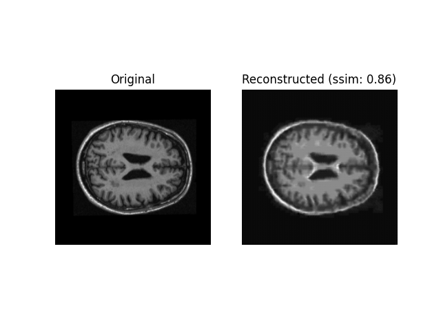

# Synthetic Brain MRI Image Generation with VQ-VAE

## COMP3710 Pattern Flow Report

by Alex Nicholson (45316207)

---

## Project Overview

* **Description of the algorithm and the problem that it solves (approximately a paragraph)**
* **How it works (approximately a paragraph)**

Details:

* Model: [VQ-VAE (original)](https://arxiv.org/abs/1711.00937)
* Dataset: [OASIS](https://www.oasis-brains.org/#data)

Goals:

* “Reasonably clear image”
* [Structured Similarity (SSIM)](https://en.wikipedia.org/wiki/Structural_similarity) index of over 0.6

---

## Setup

**List any dependencies required, including versions and address reproduciblility of results, if applicable.**

1. Install the conda envirinoment...
2. Download the OASIS dataset from [this link](https://cloudstor.aarnet.edu.au/plus/s/tByzSZzvvVh0hZA/download)
3. Activate the conda environment
4. Run train.py

---

## Methods

**Describe any specific pre-processing you have used with references if any.**

**Justify your training, validation and testing splits of the data.**
The training, validation and testing splits of the data were used as provided in the original dataset, with these partitions taking up X%, Y%, and Z% respectively. This is in line with good standard practice for dataset partitioning...

Train: 9664
Validate: 1120

Test: 544

---

## Results

### Example Generations

Below are some examples of the generations made by the VQ VQE model after 10 epochs of training over the full OASIS training dataset. These generations were produced by putting real MRI image examples from the test set into the model and then getting the reconstructed output from the model.

|       |  |
| ----------- | ----------- |
|       |        |
|       |        |

### Generation Quality Over Time

Below is an animation of the progression of the quality of the model's generations over the course of training.

### Training Metrics

The various loss metrics of the model were recorded throughout training to track its performance over time, these include:

* Total Loss: What does the total loss represent???
* Reconstruction Loss: What does the reconstruction loss represent???
* VQ VAE Loss: What does the VQ VAE loss represent???

These losses are plotted over the course of the models training in both standard and log scales below:

Model Log Loss Progress Throughout Training:

In addition to statistical losses, a more real world metric to track the quality of our generations over time is to compare the similarity of the reconstructed output images it produces with the original input image they are created from. This similarity can be measured by the SSIM (Structured Similarity Index). At the end of each epoch, the SSIM was computed for 10 randomly selected images from the test dataset, and the average was recorded. This average SSIM can be seen plotted over time below:

---

## TODO

- [x] Data importing
- [x] Model class
- [x] Model basic training function
- [x] Live training performance data logging
- [x] Output image results visualisation
- [x] Implement saving of output images to file
- [ ] Save images during training to show the progress
- [x] Training metrics over time plot
- [x] SSIM performance calculation
- [ ] Port my code over to the hpc for speedy slurm training
- [x] Do a big training run to push the standrard of output generations
- [x] Tune hyperparameters until results meet the standard
- [ ] Report writeup, etc.
